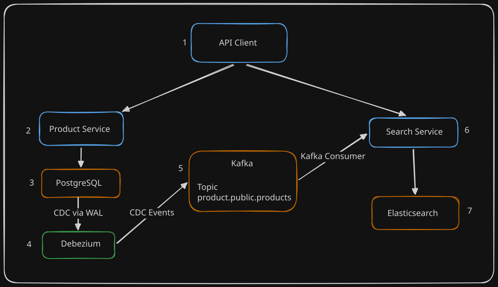

# Product Search with CDC & Elasticsearch

A simple event-driven product search system built with **NestJS**, **Next.js**, **PostgreSQL**, **Debezium**, **Apache Kafka**, and **Elasticsearch**.

The project demonstrates how Change Data Capture (CDC) can synchronize relational database changes into Elasticsearch without coupling the Product Service to the Search Service.

---

## Architecture



---

## Data Flow

1. A client creates, updates, or deletes a product through the Product Service.
2. Product Service persists the changes to PostgreSQL.
3. PostgreSQL records the changes in its Write-Ahead Log (WAL).
4. Debezium captures the database changes using Change Data Capture (CDC).
5. Debezium publishes events to Kafka.
6. Search Service consumes Kafka events.
7. Elasticsearch indexes the product document.

---

## Tech Stack

### Framework

- NestJS

### Database

- PostgreSQL
- Prisma ORM

### Change Data Capture (CDC)

- Debezium

### Event Streaming

- Apache Kafka

### Search Engine

- Elasticsearch

### Infrastructure

- Docker Compose

---

## Features

### Product Service

- [x] Product CRUD
- [x] Category CRUD
- [x] Pagination
- [x] Request Validation

### Search Service

- [x] CDC Synchronization with Debezium
- [x] Kafka Event Consumer
- [x] Product Indexing
- [x] Category Indexing
- [x] Full-text Search
- [x] Fuzzy Search
- [x] Category Filter
- [x] Price Range Filter
- [x] In-stock Filter
- [x] Sorting
- [x] Pagination
- [x] Highlight Search Results
- [x] Category Facets
- [x] Price Range Facets

## Coming Soon

### Frontend

- [ ] Implement API on Next.js Web Application

## Project Structure

```
.
├── apps
│   ├── product-service
│   └── search-service
│
├── infrastructure
│   ├── docker-compose.yaml
│   ├── debezium
│   └── postgres
│
├── docs
│   ├── architecture.md
│   └── images
│
└── README.md
```

---

## Future Improvements

- Authentication
- Dead Letter Queue (DLQ)
- Retry Mechanism
- Monitoring
- Structured Logging
- CI/CD Pipeline
- Kubernetes Deployment