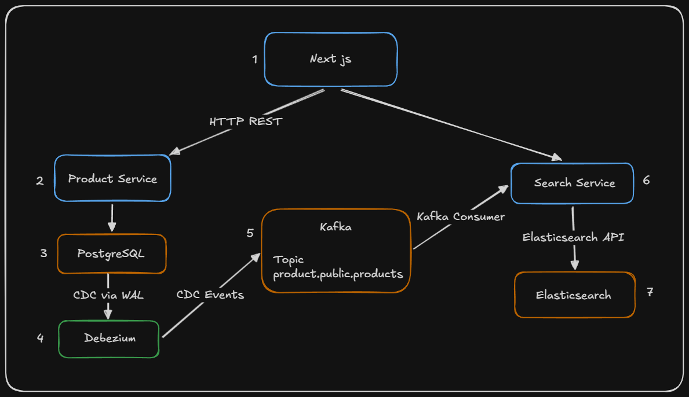

# Product Search with CDC & Elasticsearch

A simple event-driven product search system built with **NestJS**, **Next.js**, **PostgreSQL**, **Debezium**, **Apache Kafka**, and **Elasticsearch**.

The project demonstrates how Change Data Capture (CDC) can synchronize relational database changes into Elasticsearch without coupling the Product Service to the Search Service.

---

## Architecture



---

## Data Flow

1. User interacts with the Next.js application.
2. Product Service persists data into PostgreSQL.
3. PostgreSQL records changes in WAL.
4. Debezium captures the changes through CDC.
5. Debezium publishes events to Kafka.
6. Search Service consumes Kafka events.
7. Elasticsearch indexes the product document.

---

## Tech Stack

### Frontend

- Next.js
- TypeScript
- Tailwind CSS

### Backend

- NestJS
- PostgreSQL
- Prisma ORM

### Messaging

- Apache Kafka
- Debezium

### Search

- Elasticsearch
- Kibana

### Infrastructure

- Docker Compose

---

## Features

### Product Service

- [ ] Create Product
- [ ] Update Product
- [ ] Delete Product
- [ ] Product Categories
- [ ] Pagination
- [ ] Validation
- [ ] Swagger API

### Search Service

- [ ] Full-text Search
- [ ] Fuzzy Search
- [ ] Category Filter
- [ ] Price Filter
- [ ] Sorting
- [ ] Pagination
- [ ] Highlight Search Result

### Infrastructure

- [ ] PostgreSQL
- [ ] Kafka
- [ ] Debezium
- [ ] Elasticsearch
- [ ] Kibana

---

## Project Structure

```
.
├── apps
│   ├── web
│   ├── product-service
│   └── search-service
│
├── infrastructure
│   ├── docker-compose.yml
│   ├── kafka
│   ├── debezium
│   └── elasticsearch
│
├── docs
│   ├── architecture.md
│   └── images
│
└── README.md
```

---

## Learning Objectives

This project aims to learn:

- Change Data Capture (CDC)
- Event-Driven Architecture
- Apache Kafka
- Debezium
- Elasticsearch
- Full-text Search
- Docker Compose
- Distributed Systems fundamentals

---

## Future Improvements

- Authentication
- Dead Letter Queue (DLQ)
- Retry Mechanism
- Monitoring
- Structured Logging
- CI/CD Pipeline
- Kubernetes Deployment